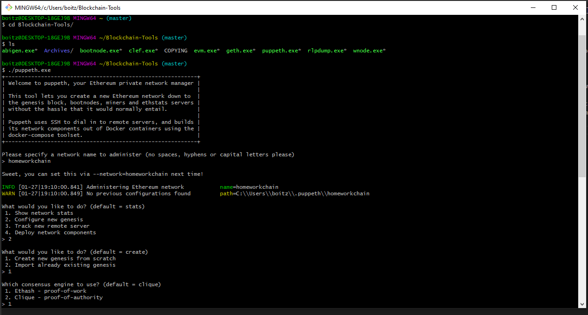
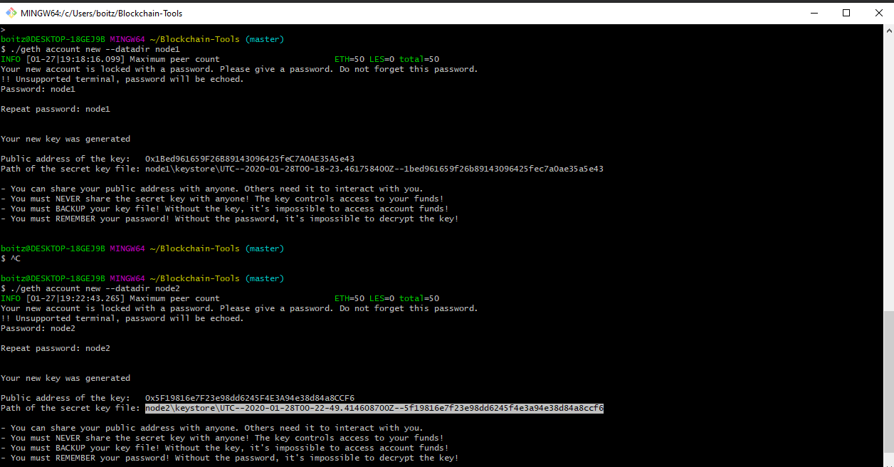
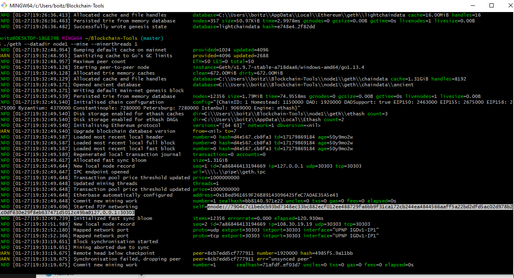

# Unit-19-Blockchain

After recently accepting a role at Valley National Bank, I have been asked to set up a testnet for the developers to send test coins along the blockchain back and forth. This will allow them to experiment with the viability of the blockchain as a money transfer tool.

Before we can send test coins back and forth there are some pre-requisites needed:
- Puppeth This is a tool that generates a Genesis Block. Without running this program there will be nothing to transact on. We will begin by running our own private network on puppeth.exe
- Geth, a command line tool that we will use to create keys and initialize nodes. Later we will also use it to connect the nodes and allow them to communicate.
- The Clique Proof of Authority Algorithm is currently one of 3 algorithms that the blockchain uses to verify transactions. We will be using this algorithm.

We initially start the genesis block by launching the puppeth.exe program

In puppeth, we have named our network "homeworkchain"
We then select "2. Configure a new genesis"
After this, select "1. Create new genesis from scratch"

For the purpose of this excersize we have selected "1. Ethash - proof of work"
We then logged into MyCryptoApp and accessed our wallet, from here we were bale to highlight some of the accounts we want funded. We then pre-funded these accounts with some fake crypto.
Also we set a chain/network ID at this step.
Once we have completed this, our genesis block has been configured. From here we can now manage the existing genesis block
By exporting our genesis configurations in json files, we can later access them in our private network.

Using the ./geth command will allow us to initilize the two nodes we created.

